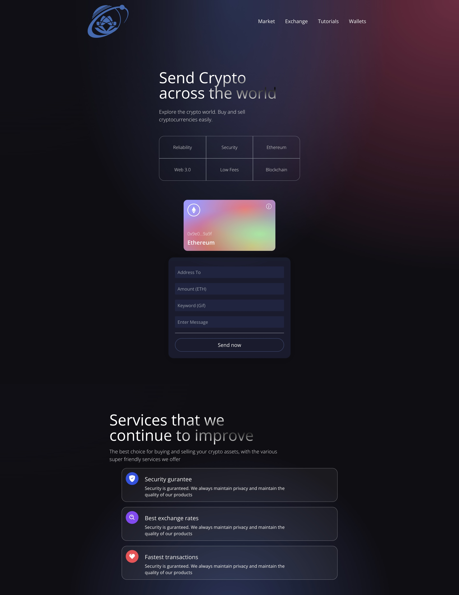

# ETH - Token transfer application

## Table of Contents
* [Introduction](#introduction)
* [Video Demo](#video-demo)
* [Technologies Used](#technologies-used)
* [How to install and run the project](#how-to-install-and-run-the-project)
* [Author](#author)

<!-- * [License](#license) -->

## Introduction
This is token transfer application using Ethereum Smart Contracts and Solidity

## Video Demo
You can have a look ETH application through [the video](https://www.youtube.com/watch?v=8hd0OkbUlQs).

## Technologies Used
ETH application use the following technologies, frameworks and development techniques:

Ethereum Smart Contracts and Solidity
- Hardhat
- Chain
- Web3.js
- React.js

## How to install and run the project
To clone and run this application.

After that, in other to run project, your command line will be in terminal:
- `npm run dev` to run Front end

## Author
- [Lucas Tran](https://github.com/LucasTran-tq)
